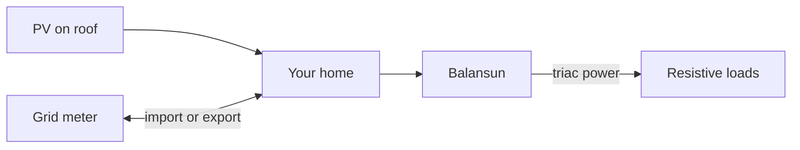

  <a href="https://github.com/Balansun/ESP32-router">
    <picture>
      <source media="(prefers-color-scheme: dark)" srcset="assets/brand/balansun-logo-dark.svg" />
      
    </picture>
  </a>

  <strong>Route PV surplus to your loads. Hold the incomer near zero.</strong> 
  Divert rooftop excess into resistive loads — water heater, radiators, and more — from an ESP32 on your LAN. 
  <em>GitHub repository: <a href="https://github.com/Balansun/ESP32-router">ESP32-router</a></em>

  
  
  

---

## How it helps you

When your solar panels produce more than the house uses, the extra energy would normally **export through the grid meter**. Balansun watches **net power at your incomer** and drives a **local resistive load** (usually a water heater) so you **keep more solar at home** instead of giving it away cheaply.

- **Use your own PV** — heat water or other resistive loads when you have surplus
- **Simple setup** — download firmware, join Wi‑Fi, configure from your phone browser (**English & French**)
- **Your metering** — Linky, JSY module, Shelly, Enphase, and more (see below)
- **Optional Home Assistant** — automatic MQTT discovery on your broker

---

## Works with your setup

| You have… | Balansun source | Notes |
|-----------|------------------|-------|
| French **Linky** smart meter (TIC) | `Linky` | Standard 9600 baud mode required |
| **JSY MK-194T** dual-channel meter | `JsyMk194` | House + load channels |
| **JSY MK-333** three-phase meter | `JsyMk333` | Modbus on UART |
| **Shelly EM / 3EM** on your LAN | `ShellyEm` | HTTP energy API |
| **Enphase IQ Gateway** | `Enphase` | Consumption reports |
| **Smart Gateways** Wi‑Fi gateway | `SmartG` | P1 gateway, port 82 |
| Custom **voltage + current** front-end | `Analog` | Analog incomer measurement |
| Another **Balansun** already measuring | `BalansunPeer` | Reuse its reading over HTTP |
| Power data on **MQTT** | `Pmqtt` | Subscribe to a JSON topic |

Product profiles and meter packs: [`docs/PRODUCT_PROFILES.md`](docs/PRODUCT_PROFILES.md).

---

## Get started

1. **Download firmware** — [GitHub Releases](https://github.com/Balansun/ESP32-router/releases) → `balansun-*-wroom32-firmware.bin` (ESP32-WROOM-32 boards).
2. **Flash and configure** — see [`firmware/FIRMWARE_BUILD.md`](firmware/FIRMWARE_BUILD.md) (flash, Wi‑Fi, security, OTA).
3. **Optional: Home Assistant** — [HACS integration](https://github.com/Balansun/HACS) or MQTT discovery (see [`integrations/README.md`](integrations/README.md)).

---

## Documentation in this repository

| Topic | Document |
|-------|----------|
| Build, meter packs, OTA | [`firmware/FIRMWARE_BUILD.md`](firmware/FIRMWARE_BUILD.md) |
| Product profiles & PlatformIO envs | [`docs/PRODUCT_PROFILES.md`](docs/PRODUCT_PROFILES.md) |
| REST API contract | [`openapi/balansun-v1.yaml`](openapi/balansun-v1.yaml) |
| Home Assistant | [`integrations/README.md`](integrations/README.md) |
| Contributing & CI | [`CONTRIBUTING.md`](CONTRIBUTING.md) |
| Release history | [`CHANGELOG.md`](CHANGELOG.md) |

---

## Developers

Build from source, REST `/api/v1`, OpenAPI, CI, and release process: [`CONTRIBUTING.md`](CONTRIBUTING.md) and [`firmware/FIRMWARE_BUILD.md`](firmware/FIRMWARE_BUILD.md).

Shared triac logic lives in [`lib/balansun-core/`](lib/balansun-core/).

Field-help markdown: `cd web && npx tsx scripts/generate-field-help-docs.ts` (see [CONTRIBUTING.md](CONTRIBUTING.md)). Local CI-parity: `./scripts/run_all_firmware_checks.sh`.

---

## License and safety

This project is **EUPL-1.2** — see [`LICENSE`](LICENSE) and the header in [`firmware/Balansun.ino`](firmware/Balansun.ino).

**Mains wiring is your responsibility.** This project interfaces with **line voltage**; follow local rules, use qualified help where required, and respect meter / Linky interface limits.

On your home LAN the web UI is **open by default** — set an **HTTP API password** in Settings before you trust the network. **Do not** expose port 80 to the internet without TLS and a proper front door.
