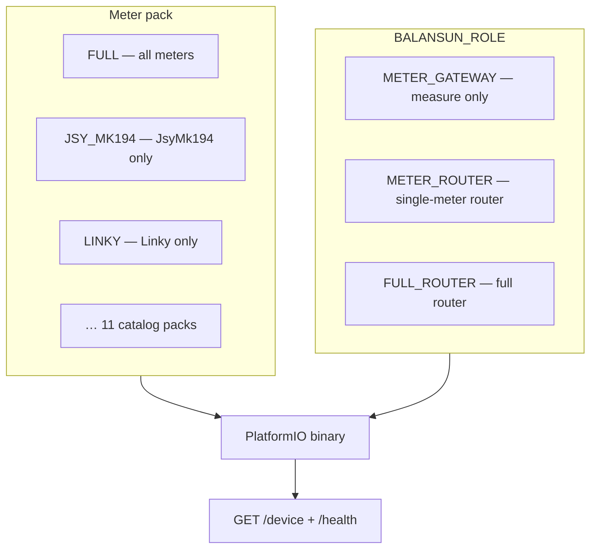
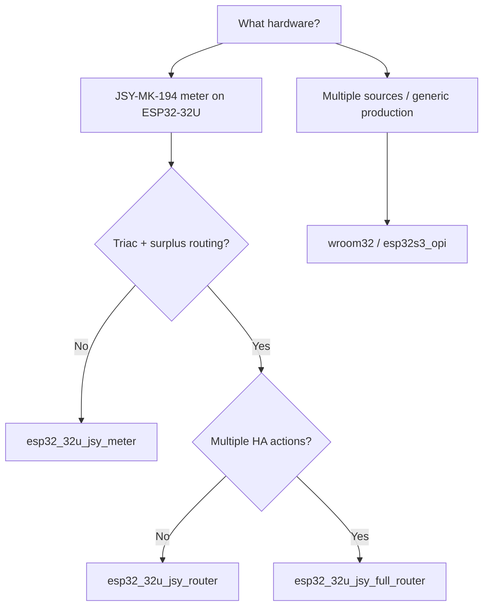

# Balansun product profiles — detailed guide

This document explains how firmware selects **what to measure** (meter pack) and **what to control** (router role), how that appears in the REST API, and how to flash the correct PlatformIO binary.

Code references: [`balansun_product_profile.h`](../firmware/core/balansun_product_profile.h), [`balansun_product_caps_logic.cpp`](../firmware/core/balansun_product_caps_logic.cpp), [`balansun_meter_pack.cpp`](../firmware/core/balansun_meter_pack.cpp), [`meter_pack_manifest.json`](../firmware/metering/meter_pack_manifest.json), golden matrix [`profile_test_matrix.json`](../firmware/test/golden/profile_test_matrix.json), UI catalog [`firmware-catalog.json`](../web/public/firmware-catalog.json).

---

## Product hierarchy (Settings → Product)

| Family | Variants | PlatformIO env examples |
|--------|----------|-------------------------|
| **Meter gateway** | 11 meter packs | `linky_meter`, `jsy_mk194_meter` |
| **Router** | 11 meter packs | `linky_router`, `jsy_mk194_router` |
| **Full router** | all meters (flash exception) | `wroom32`, `esp32s3`, `hil` |

Role and pack are **compile-time** (drivers actually linked, REST `/device`, MQTT). UI behaviour:

| Flashed firmware | **Product type** / **Variant** selectors | Effect |
|------------------|------------------------------------------|--------|
| **Full** (`full_router`, `meter_pack: full`) | **Active** — choice persisted in `localStorage` (`balansun_product_mode_pio_env`) | Show/hide tabs, Settings sections, visible meters, Actions, etc. via [`profile_test_matrix.json`](../firmware/test/golden/profile_test_matrix.json). Hardware and REST API remain full-router firmware. |
| **Slim** (meter gateway, single-pack router) | **Read-only** — profile = flashed binary | If you change selection (preview), OTA banner toward `balansun-{version}-{env}-firmware.bin`. |

Each CI release publishes `balansun-{version}-{env}-firmware.bin` for every catalog row (except board-type aliases `esp32_32u_*`). SPA code: [`web/src/state/productMode.ts`](../web/src/state/productMode.ts), [`web/src/utils/firmwareCaps.ts`](../web/src/utils/firmwareCaps.ts).

---

## Two independent axes

Each binary is defined by **two compile-time macros**:

| Axis | Macro | Question answered |
|------|--------|---------------------|
| **Meter pack** | `BALANSUN_METER_PACK` | Which meter drivers are linked in flash? |
| **Product role** | `BALANSUN_ROLE` | Does firmware route surplus (triac, regulation)? |



**Important rule:** on a **router** build, triac is not a separate option — it is **always** present when `surplus_regulation` is true. Clients (web SPA, HACS, MQTT) must gate triac only via `firmware_capabilities.surplus_regulation`, not via an isolated `triac` key (it mirrors `surplus_regulation` in REST JSON).

---

## Product roles (`BALANSUN_ROLE`)

| Role | Macro | PlatformIO env suffix | Behaviour |
|------|--------|------------------------|-----------|
| Meter gateway | `BALANSUN_ROLE_METER_GATEWAY` | `{pack}_meter` | Telemetry only — **no** triac, **no** surplus regulation, **no** triac self-test |
| Single-meter router | `BALANSUN_ROLE_METER_ROUTER` | `{pack}_router` | One meter type + triac + regulation + commissioning self-test |
| Full router | `BALANSUN_ROLE_FULL_ROUTER` | `wroom32`, `hil`, `{pack}_full_router` | Like router + **`multi_action`** + **`source_test_inject`** (inject reserved for lab / `hil` env) |

`{pack}_meter` envs also add `-DMETER_ONLY_BUILD=1`.

### Internal capabilities per role

All variants include by default: `mqtt_ha`, `vacation`, `pwm`.

| Capability (`BalansunCap`) | REST key / API guard | METER_GATEWAY | METER_ROUTER | FULL_ROUTER |
|------------------------------|----------------------|:-------------:|:------------:|:-----------:|
| `SurplusRegulation` | `surplus_regulation` | — | ✓ | ✓ |
| `TriacDimming` | `triac` (mirror) | — | ✓ | ✓ |
| `SelfTestTriac` | `self_test_triac` | — | ✓ | ✓ |
| `StatusLedRgb` | (hardware / config) | — | ✓ | ✓ |
| `MultiAction` | `multi_action` | — | — | ✓ |
| `SourceTestInject` | `source_test_inject` | — | — | ✓* |

\* `source_test_inject` is active only when firmware is built with the inject API (`BALANSUN_ENABLE_SOURCE_TEST_API`, `hil` env).

---

## REST identifier `product_profile`

Exposed in `GET /api/v1/health`, `GET /api/v1/device` → `capabilities.product_profile`.

Convention: `{meter_pack_id}_{role_suffix}` except the multi-meter full router.

| Role | Pattern | Examples |
|------|---------|----------|
| `METER_GATEWAY` | `{pack}_meter` | `jsy_mk194_meter`, `linky_meter`, `pmqtt_meter` |
| `METER_ROUTER` | `{pack}_router` | `jsy_mk194_router`, `linky_router` |
| `FULL_ROUTER` (FULL pack) | `full_router` | `wroom32`, `hil`, `esp32s3_opi` |
| `FULL_ROUTER` (single pack) | **`full_router`** also | `jsy_mk194_full_router` → REST profile **`full_router`**, `meter_pack: jsy_mk194` |

> **Note:** for `{pack}_full_router`, the REST wire stays `full_router` (FULL role), but `firmware_capabilities.meter_pack` indicates the single pack (`jsy_mk194`, etc.) and `meters[]` contains one entry.

Generic fallbacks when the pack has no dedicated alias: `meter_router`, `meter_gateway`.

---

## Meter packs (catalog)

Generated from [`metering/meter_pack_manifest.json`](../firmware/metering/meter_pack_manifest.json). Each pack produces **three** PlatformIO envs:

- `{id}_meter` — gateway  
- `{id}_router` — single-meter router  
- `{id}_full_router` — full router, single meter  

| Pack ID | REST source wire | Transport | Main driver |
|---------|------------------|-----------|-------------|
| `jsy_mk194` | `JsyMk194` | serial | JSY-MK-194T |
| `jsy_mk333` | `JsyMk333` | serial | JSY-MK-333 |
| `analog` | `Analog` | ADC | U/I probe |
| `linky` | `Linky` | TIC serial | Linky + Tempo/RTE |
| `enphase` | `Enphase` | HTTPS LAN | Envoy |
| `shelly_em` | `ShellyEm` | HTTP | Shelly EM |
| `shelly_pro` | `ShellyPro` | HTTP | Shelly Pro EM |
| `smartg` | `SmartG` | HTTP | Smart Gateway |
| `homew` | `HomeW` | HTTP | HomeWizard |
| `pmqtt` | `Pmqtt` | MQTT | MQTT meter |
| `balansun_peer` | `BalansunPeer` | HTTP | another Balansun router |

**`FULL`** pack (default `wroom32`): all drivers above (+ `NotDef` on lab `hil` env).

Regenerate headers and envs after manifest changes:

```bash
python3 scripts/generate_meter_pack.py
python3 scripts/generate_meter_pack.py --check   # CI gate
```

---

## REST JSON `firmware_capabilities`

Typical fragment from `GET /api/v1/device`:

```json
{
  "capabilities": {
    "product_profile": "jsy_mk194_router",
    "firmware_capabilities": {
      "surplus_regulation": true,
      "triac": true,
      "multi_action": false,
      "source_test_inject": false,
      "meter_pack": "jsy_mk194",
      "meters": ["JsyMk194"]
    }
  }
}
```

### Examples by profile

| `product_profile` | `surplus_regulation` | `multi_action` | `self_test_triac` (API) | Typical use |
|-------------------|:--------------------:|:--------------:|:-------------------------:|-------------|
| `jsy_mk194_meter` | false | false | **403** | JSY gateway on ESP32-32U |
| `jsy_mk194_router` | true | false | **200** | **Recommended JSY router** (32U bench) |
| `full_router` + `meter_pack: jsy_mk194` | true | true | **200** | JSY only + multi-action |
| `full_router` + `meter_pack: full` | true | true | **200** | Generic multi-source production |

Reference goldens: [`firmware/test/golden/profiles/`](../firmware/test/golden/profiles/).

---

## PlatformIO envs — ESP32-32U + JSY-MK-194

Board alias **`BALANSUN_BOARD_ESP32_32U`** (lab 32U board):

| Env | Extends | `product_profile` | When to use |
|-----|---------|-------------------|-------------|
| **`esp32_32u_jsy_router`** | `jsy_mk194_router` | `jsy_mk194_router` | **JSY router** — triac, regulation, self-test, **without** multi-action |
| `esp32_32u_jsy_meter` | `jsy_mk194_meter` | `jsy_mk194_meter` | Meter gateway only |
| `esp32_32u_jsy_full_router` | `jsy_mk194_full_router` | `full_router` | JSY only + `full_router` caps (`multi_action`, etc.) |

OTA (network):

```bash
export BALANSUN_UPLOAD_PORT=192.168.2.159
pio run -e esp32_32u_jsy_router_ota -t upload
```

USB:

```bash
pio run -e esp32_32u_jsy_router -t upload
# or BALANSUN_UPLOAD_PORT=/dev/cu.usbserial-0001 pio run -e esp32_32u_jsy_router -t upload
```

Generic production envs (all meters): `wroom32`, `esp32s3_opi`, OTA `esp32s3_ota`. HIL lab: `hil` (inject + RemoteDebug).

---

## API guards and errors

### `capability_disabled` (HTTP 403)

Typical response when a route requires a capability absent from the profile:

```json
{
  "error": "capability_disabled",
  "missing_cap": "self_test_triac",
  "message": "Triac self-test is not available on this firmware profile"
}
```

| `missing_cap` | Affected routes (excerpt) |
|---------------|----------------------------|
| `surplus_regulation` | `POST /triac/override`, `POST /actions/*/override`, regulation config keys |
| `self_test_triac` | `POST /health/self-test/run` |
| `multi_action` | action overrides index ≥ 1 |
| `source_test_inject` | `POST /sources/test/inject` |

Full registry: [`balansun_api_caps.h`](../firmware/core/balansun_api_caps.h), config keys: [`balansun_config_cap_logic.cpp`](../firmware/core/balansun_config_cap_logic.cpp).

### `safety_lockout` (HTTP 403)

Independent of **router** profile: if commissioning self-test failed on a **critical** check (ZC, triac), firmware blocks routing writes until a new test passes.

```json
{
  "error": "safety_lockout",
  "message": "Routing is disabled until commissioning self-test passes …"
}
```

Visible in `GET /health` → `safety_lockout`, `self_test.safety_lockout_active`, `output_suspend.reason: safety_lockout`.

---

## Consumer impact

### Embedded SPA (`web/`)

- [`firmwareCaps.ts`](../web/src/utils/firmwareCaps.ts): `hasSurplusRegulation()`, `hasMultiAction()`, filter sources by `meters[]`.
- Self-test panel ([`SelfTestPanel.ts`](../web/src/components/SelfTestPanel.ts)): **Run** calls `POST /health/self-test/run` — fails with 403 on `*_meter` profile.
- Triac / calibration settings cards: hidden when `!hasSurplusRegulation()`.

### Home Assistant (HACS)

- Triac / regulation entities filtered when `firmware_capabilities.surplus_regulation === false`.
- Diagnostic sensors: `product_profile`, `meter_pack`, `safety_lockout_active`.
- After profile change via OTA: **reload** the integration.

### MQTT discovery

Entity parity with REST; no dynamic cap discovery — republish after profile change.

---

## Choosing the right profile



| Need | Recommended env |
|------|-----------------|
| Show JSY consumption, no triac | `esp32_32u_jsy_meter` |
| JSY solar router (most common 32U case) | **`esp32_32u_jsy_router`** |
| JSY + multiple routed actions | `esp32_32u_jsy_full_router` |
| Linky-only router | `linky_router` |
| All sources, production | `wroom32` or `esp32s3_opi` |
| Lab inject / HIL tests | `hil` |

---

## Verification after flash

```bash
export BALANSUN_API_BEARER_TOKEN=…   # or admin password
curl -sS -H "Authorization: Bearer $BALANSUN_API_BEARER_TOKEN" \
  http://<ip>/api/v1/health | jq '.product_profile, .safety_lockout'

curl -sS -H "Authorization: Bearer $BALANSUN_API_BEARER_TOKEN" \
  http://<ip>/api/v1/device | jq '.capabilities'
```

Expected on **`esp32_32u_jsy_router`**:

- `product_profile`: `"jsy_mk194_router"`
- `firmware_capabilities.surplus_regulation`: `true`
- `POST /api/v1/health/self-test/run` → **200** (not `missing_cap: self_test_triac`)

HIL wait script: `python3 firmware/test/hil/wait_for_device.py`.

Profile suite: `pytest firmware/test/hil/test_profile_caps.py`, `./scripts/run_hil_profile_matrix.sh`.

---

## Files and generation

| File | Role |
|------|------|
| `firmware/metering/meter_pack_manifest.json` | Pack source of truth |
| `scripts/generate_meter_pack.py` | Generates `balansun_meter_pack.*`, `platformio/meter_packs.ini` |
| `platformio/meter_packs.ini` | `{pack}_{meter,router,full_router}` envs (auto-generated) |
| `platformio.ini` | Board envs (`esp32_32u_*`, `hil`, `wroom32`, …) |
| `firmware/test/golden/profile_test_matrix.json` | CI UI + HIL matrix |

See also [`FIRMWARE_BUILD.md`](../firmware/FIRMWARE_BUILD.md) for per-board-tier history retention and OTA notes.
